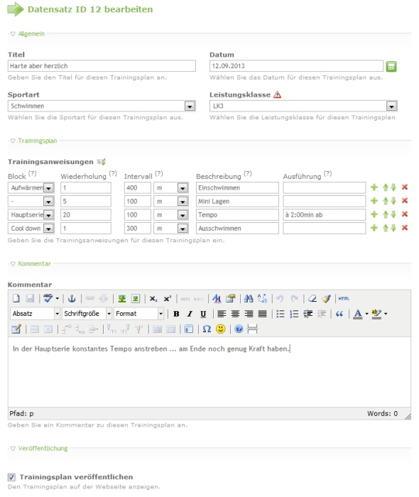

Contao Extension: TriathlonTrainingplanManager
==============================================

Managing triathlon training plans for displaying it in frontend.

Installation
------------

Install the extension via composer: [cliffparnitzky/triathlon-trainingplan-manager](https://packagist.org/packages/cliffparnitzky/triathlon-trainingplan-manager).

If you prefer to install it manually, download the latest release here: https://github.com/cliffparnitzky/TriathlonTrainingplanManager/releases

Tracker
-------

https://github.com/cliffparnitzky/TriathlonTrainingPlanManager/issues

Compatibility
-------------

- min. Contao version: >= 3.2.0
- max. Contao version: <  3.5.0

Dependency
----------

- This extension is dependent on the following extensions: [[menatwork/contao-multicolumnwizard]](https://packagist.org/packages/menatwork/contao-multicolumnwizard)

Screenshots
-----------

